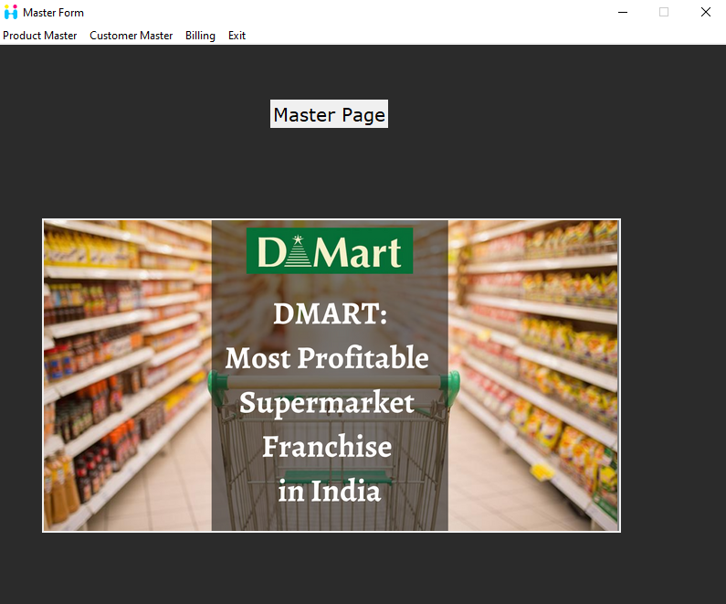

# The Python Project for 2023 🐍
Here, I will learn and practice Python programming, building practical projects, and strengthening my coding skills.

# Billing System using Tkinter module integrate with MYSQL

# 📆 Progress
I will update this README file regularly to document my progress. Here's an overview of my journey so far:

# 🏅 Goals

Gain a solid understanding of Python core concept programming language.
Build a strong foundation in software development principles.
Develop the ability to solve complex coding problems efficiently.
Create a diverse portfolio of Python projects to showcase my skills.
Cultivate a consistent coding habit and continue learning beyond the course.
# 🎯 Motivation
I have decided to undertake this journey because I believe that learning Python is essential for my career growth and personal development. I am excited to expand my programming knowledge, collaborate with other learners, and challenge myself to become a proficient Python programmer.

Let's code and make the most out of this amazing learning experience! 💪🔥
